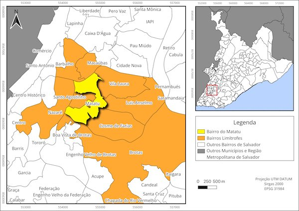
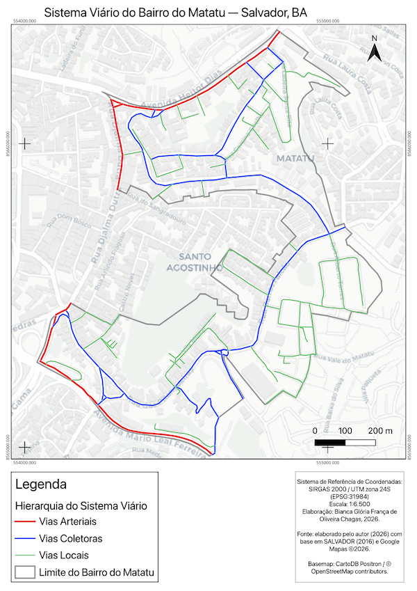

# Geoprocessamento e Socioeconomia do Bairro do Matatu — Salvador/BA
[](https://doi.org/10.5281/zenodo.20739055)

Repositório com mapas temáticos produzidos a partir de estudo de geoprocessamento e análise socioeconômica do bairro **Matatu**, em Salvador, Bahia. O material foi confeccionado por **Bianca Glória França de Oliveira Chagas** e está disponível aqui para consulta pública e documentação científica.

## 📍 Sobre o projeto

Este estudo foi desenvolvido no âmbito do Projeto Cidades Internas (PCI), vinculado à Universidade Salvador (UNIFACS), com apoio da Coordenação de Aperfeiçoamento de Pessoal de Nível Superior (CAPES). O objetivo é mapear e analisar aspectos socioeconômicos e geoespaciais do bairro do Matatu, em Salvador, contribuindo para a compreensão da dinâmica urbana e social do território a partir de técnicas de geoprocessamento.

> ⚠️ **Projeto em andamento:** a pesquisa tem previsão de conclusão em dezembro de 2026. Este repositório será atualizado periodicamente conforme novos mapas e análises forem produzidos.

**Localização do estudo:** Bairro do Matatu, Salvador, Bahia, Brasil
**Período de elaboração:** 03/2026 – 12/2026
**Vínculo institucional:** Universidade Salvador (UNIFACS), Projeto Cidades Internas (PCI)

## 🗺️ Mapas produzidos

### Delimitação do Bairro do Matatu



Mapa de localização e delimitação do Bairro do Matatu em relação aos bairros limítrofes e ao município de Salvador.

📎 [Ver mapa em alta resolução](mapas/finais/mapa_delimitacao_bairro.png)

### Sistema Viário do Bairro do Matatu



Mapa de hierarquia viária do Bairro do Matatu, classificando as vias em arteriais, coletoras e locais, com base em dados da Prefeitura de Salvador (2016) e Google Maps (2026).

📎 [Ver mapa em alta resolução](mapas/finais/Mapa_Sistema_Viário_do_Matatu.png)

*(Mais mapas serão adicionados aqui conforme forem produzidos.)*

## 🛠️ Metodologia e dados

- **Software utilizado:** QGIS 3.44
- **Sistema de referência/Datum:** SIRGAS 2000
- **Fontes de dados:** IBGE (Censo, malha de setores censitários), SEI-BA, Prefeitura de Salvador (SUCOM/SEMOB), OpenStreetMap, etc.
- **Período de referência dos dados:** Diverso e Censo 2022.

*A documentação detalhada da metodologia está em elaboração e será publicada em breve nesta seção.*

## 📂 Estrutura do repositório

```
.
├── mapas/
│   ├── finais/        # Mapas em PNG/JPG/PDF, prontos para visualização
│   └── preview/        # Miniaturas usadas neste README
├── sig/
│   ├── shapefiles/     # Arquivos vetoriais .shp
│   ├── geojson/        # Arquivos .geojson
│   └── qgis/           # Projeto(s) QGIS (.qgz/.qgs)
├── dados/               # Dados brutos/fontes utilizadas (quando aplicável)
├── docs/
│   └── metodologia.md
├── LICENSE
├── CITATION.cff
└── README.md
```

## 📜 Licença

Este material está licenciado sob **Creative Commons Atribuição-NãoComercial 4.0 Internacional (CC BY-NC 4.0)**. Isso significa que você pode usar, compartilhar e adaptar os mapas e dados para fins acadêmicos, educacionais e não-comerciais, desde que seja dado o devido crédito ao autor. **Uso comercial requer autorização prévia** — entre em contato através dos dados informados na seção "Autor" abaixo. Veja [`LICENSE`](LICENSE) para detalhes completos.

## 📑 Como citar

Se utilizar este material em trabalhos acadêmicos, técnicos ou outros, por favor cite conforme indicado em [`CITATION.cff`](CITATION.cff), ou no formato:

> CHAGAS, Bianca G. F. O. *Geoprocessamento e Socioeconomia do Bairro do Matatu, Salvador-BA*. 2026. Disponível em: https://github.com/biachagas/geoprocessamento-do-matatu

## 👤 Autor

**Bianca Glória França de Oliveira Chagas**
Lattes: http://lattes.cnpq.br/6882612035536485
ORCID: https://orcid.org/0009-0009-4859-8666
Contato: biancachagas.ba@gmail.com
